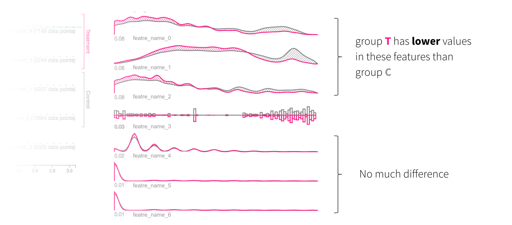

# Manifold

Manifold is described as a "model-agnostic debugging tool for Machine Learning at Uber."  This tool, which does not appear to be publicly available, purports to be a one-stop debugging tool for Machine Learning.

## Problem Overview

Opacity of models is the cited problem and transparency is the solution.  The problem with many attribution libraries is that they are very specifically focused on a framework (e.g., Captum is a PyTorch component) and/or 
are focused broadly on a type of model (image recognition, NLP, etc).  Thus, mostly there.

## Visualizations

Manifold does have quite a few attribution visualizations available.

## Conclusion

Much like Uber's ML stack based on Michelangelo, Uber's Manifold is more interesting as a proof of what is possible using. Like Michelangelo, it is likely that Manifold is mainly built around integration of 
open source tools, but without doubt there was a considerable internal engineering effort to get to that point.  

